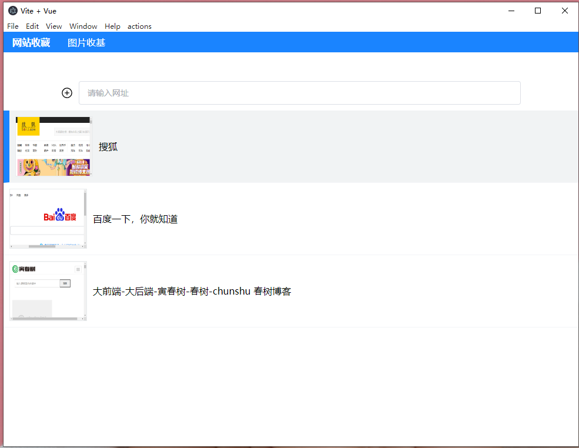

# Vue 3 + Vite + Pinia +Electron小案例

为了学习vue3+electron跟着一个系列课堂做的小案例

课堂地址：https://www.bilibili.com/video/BV1FP4115739

可以正常运行并生成exe等文件，

里面功能齐全，

非常合适初学着学习使用。

## 操作要点

"dev": "vite", //运行vue，electron中用到的vue项目需要运行起来了在electron中才能看到，你可以直接在本机部署，也可以部署到服务器。

"build": "vite build",

"preview": "vite preview",

"start": "chcp 65001 && nodemon --exec  electron . --watch ./ --ext .js,.html,.css,.vue",   //修改源文件可以随时打开桌面窗口看效果

"app:dist": "electron-builder"  //生成exe等文件